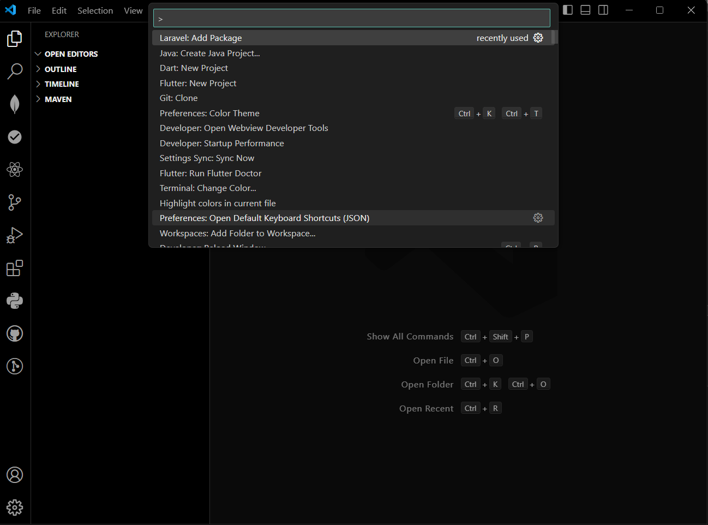
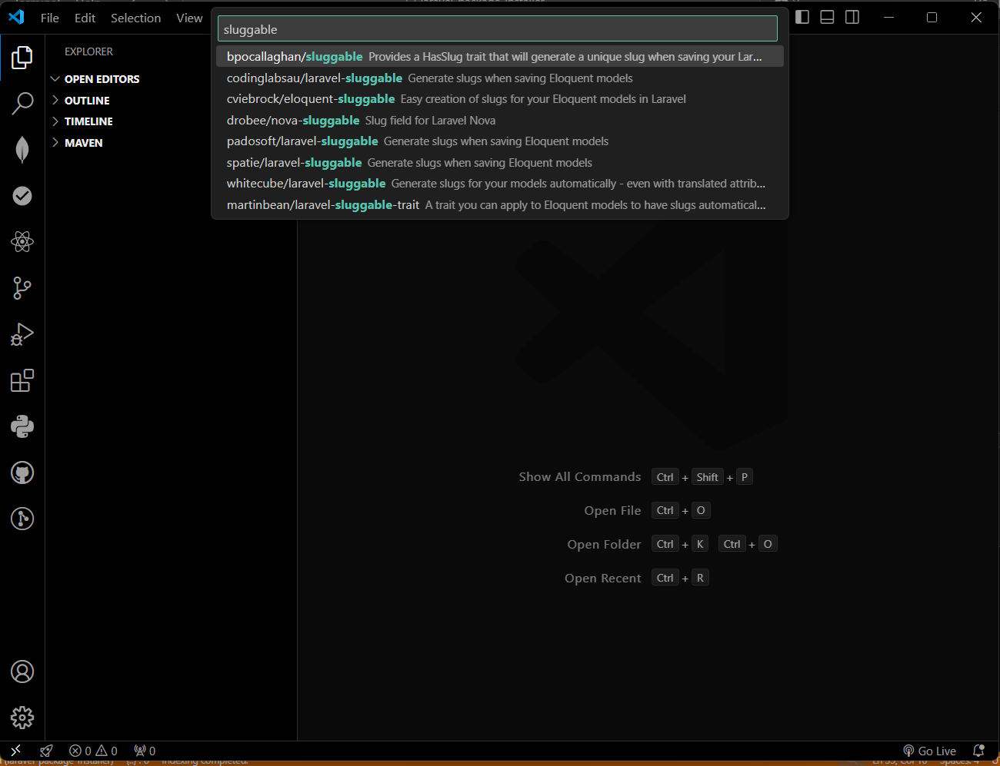

# Laravel Package Installer for VSCode

This VSCode extension allows you to search and install Laravel packages from within your editor, making it easy to manage dependencies for your Laravel projects. It allows users to search both by package name and description, providing a seamless experience to find and install packages quickly.

## Features

- **Search Laravel Packages**: Search packages by their name or description using the integrated search.
- **Predefined Suggestions**: Comes with predefined package suggestions, or you can search for additional packages from the Packagist repository.
- **One-click Installation**: Install selected packages with the command `composer require <package-name>`.
- **Real-time Filtering**: As you type, the search dynamically filters packages based on both their name and description.
- **Easy Integration**: Simple integration with your existing Laravel projects for quick setup.

## Installation

1. Open **VSCode**.
2. Press `Ctrl+Shift+X` (`Cmd+Shift+X` on macOS) to open the **Extensions** view.
3. Search for `Laravel Package Installer` and click **Install**.

### Steps:
Laravel Package Installer for VSCode

This VSCode extension allows you to search and install Laravel packages from within your editor.

## How to Use

### Step 1: Open Command Palette

To open the **Command Palette**, press `Ctrl+Shift+P` (`Cmd+Shift+P` on macOS). 

### Step 2: Search for Packages

Once the **QuickPick** interface is open, you can search for a package by its name or description. Select the package you want to install, and it will be automatically added to your Laravel project.

